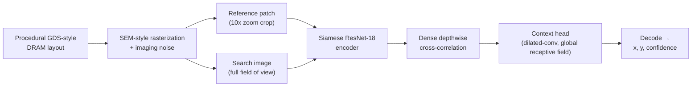
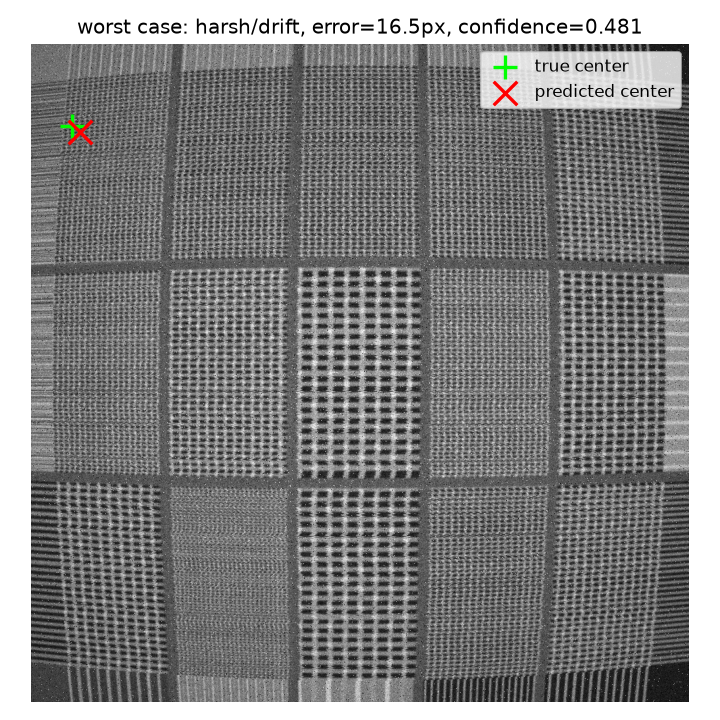

<div align="center">

# Drift-Sense

### Synthetic SEM data generation + deep-learned reference localization for wafer inspection

**SEMI x IESA Hackathon 2026 — Applied Materials Problem Statement:
Drift-Sense — AI-Powered Navigation-Error Recovery for Wafer Inspection Tools**


[Results](results/validation_report.md) · [Research notes](research/README.md)

</div>

---

When a wafer inspection tool's stage drifts off its intended coordinates,
it needs to relocate a known reference feature inside a wider search image
to recover its true position — fast, and without a human in the loop. This
repo is a from-scratch pipeline for that problem: procedurally generated
synthetic DRAM SEM imagery to train on, and a deep-learned model that finds
a small reference patch inside a much larger, differently-imaged search
frame.

Two independent pieces of work are consolidated here into one submission:

| Folder | What it is |
|---|---|
| [`Team_fab_genr/`](Team_fab_genr/) | Procedural DRAM SEM image generator — GDS-style layout, SEM-style rasterization, imaging-noise pipeline. Generator-only (no matcher/localizer code). |
| [`Model/`](Model/) | A separate SEM image generator, plus a deep-learned reference-localization model — training, inference, and evaluation, all in one self-contained package. |

## Contents

- [How it works](#how-it-works)
- [Results at a glance](#results-at-a-glance)
- [Repository structure](#repository-structure)
- [Getting started](#getting-started)
  - [Running Team_fab_genr's generator](#running-team_fab_genrs-generator)
  - [Running Model's generator and localizer](#running-models-generator-and-localizer)
- [Running the tests](#running-the-tests)
- [Design notes](#design-notes)
- [Citations](#citations)

## How it works



A synthetic DRAM memory array — word lines, bit lines, contacts, none of
it proprietary geometry — is laid out, rendered as a grayscale SEM-style
image, and degraded with an imaging-noise model (Poisson shot noise, beam
astigmatism, raster drift, charging streaks, vignetting, and more). A
**reference** patch and the wider **search** frame it came from are cut
from that render, at a 10x zoom difference between them, with the
reference's true location kept as ground truth.

The localizer never sees that ground truth directly. It Siamese-encodes
both images, densely cross-correlates their features, then runs the
correlation surface through a wide-receptive-field context head — the
step that resolves DRAM's repeating-lattice ambiguity, where a reference
patch can look identical to several other spots on the same die and only
broader spatial context (die boundaries, aperiodic noise) disambiguates
which one is real. Decoding the resulting heatmap gives a predicted
`(x, y)` and a confidence score.

## Results at a glance

Validated against `Model/checkpoints/production_v3` across four
noise x geometry conditions (200 samples pooled, see
[`results/validation_report.md`](results/validation_report.md) for the
full breakdown and reproduction steps):

| Condition | Mean error (px) | Pass @ 5px | Pass @ 1px | Median runtime (ms) |
|---|---|---|---|---|
| Normal noise, normal geometry | 0.64 | 100.0% | 86.0% | 21.9 |
| Harsh noise, normal geometry | 4.32 | 64.0% | 22.0% | 21.9 |
| Normal noise, drift geometry | 0.67 | 100.0% | 86.0% | 22.0 |
| Harsh noise, drift geometry | 4.28 | 64.0% | 22.0% | 22.0 |
| **Pooled (n=200)** | **2.47** | — | — | — |

<div align="center">
<table>
<tr>
<td align="center" width="50%">
<br/>
<sub><b>Typical case</b> — sub-pixel error, high confidence</sub>
</td>
<td align="center" width="50%">
<br/>
<sub><b>Worst case</b> — 16.5px error under harsh noise + drift, a genuine repeated-pattern look-alike</sub>
</td>
</tr>
</table>
</div>

## Repository structure

```
Drift-Sense/
├── Team_fab_genr/            SEM generator (GDS layout → rasterization → noise), generator-only
├── Model/                    SEM generator + deep-learned localizer, self-contained
│   ├── src/                    generator infra (src/) + the model (src/localizer/)
│   ├── scripts/                  train, predict, validate, calibrate, ablate
│   └── checkpoints/                production_v3, the shipped model
├── research/                 annotated prior work backing the localization algorithm
├── results/                  sample dataset, predictions, spec-validation report
└── requirements.txt          union of both subsystems' dependencies
```

Each subsystem is independent and self-contained, with its own
`requirements.txt` and its own README going into full detail
([`Team_fab_genr/README.md`](Team_fab_genr/README.md),
[`Model/README.md`](Model/README.md)). The top-level `requirements.txt`
is their union, for a single install covering both.

> **CUDA note:** `requirements.txt` pins `torch`/`torchvision` to CUDA
> 13.0 builds (`+cu130`). For CPU-only or a different CUDA version, drop
> the `--extra-index-url` line and the `+cu130` suffix and let PyPI
> resolve them instead — inference (`localize.py` / `predict.py`) runs
> fine on CPU; only training benefits meaningfully from a GPU.

## Getting started

### Running Team_fab_genr's generator

```bash
cd Team_fab_genr
pip install -r requirements.txt
python generate_dataset.py --num-samples 20 --split train --output-dir ./output --seed 42
```

See [`Team_fab_genr/README.md`](Team_fab_genr/README.md) for the six
density presets, multi-region dies, true-zoom rendering, and
single-training-defect mode.

### Running Model's generator and localizer

```bash
cd Model
pip install -r requirements.txt
python generate_dataset.py --num-samples 20 --split test --output-dir ./output --seed 200000
python localize.py --manifest ./output/manifest.csv --output ./predictions.csv
```

(`--split test` needs a seed in `[200000, 200500)` — `production_v3` was
trained on canvas seeds `[0, 100000)`, so this exercises the held-out test
split rather than training data.)

See [`Model/README.md`](Model/README.md) for the full results table,
training lineage, evaluation methodology, and reproduction steps, plus
`Model/scripts/train.py` and `Model/scripts/validation_report.py` for
training and spec-compliance validation.

## Running the tests

```bash
cd Team_fab_genr && python -m pytest tests/ -v
cd Model         && python -m pytest tests/ -v -m "not slow"
```

## Design notes

- **`Team_fab_genr/` is generator-only.** No matcher or localizer code
  lives there — `Model/`'s deep-learned model is this submission's one
  localization approach, so `Team_fab_genr/` has no torch dependency.
- **`Model/`'s generator and localizer ship together**, not split into
  separate folders: its training-time data loader
  (`src/localizer/data.py`) generates samples on the fly by calling
  directly into the same `src/patterns/` / `src/presets.py` code its
  standalone `generate_dataset.py` CLI uses — splitting them would just
  duplicate those files.

## Citations

Prior work backing the **localization model** — Siamese matching,
depthwise correlation, dilated context aggregation, padding and
translation equivariance, heatmap/offset decoding — is collected with a
per-component code mapping in [`research/README.md`](research/README.md).

Below are the public sources backing this project's **synthetic-data and
noise-modeling** design choices, per the hackathon spec's requirement to
justify structures and augmentations against credible sources:

**DRAM 1T-1C cell structure** (word lines, bit lines, capacitor storage)
- imec, [DRAM peripheral transistors technology platform](https://www.imec-int.com/en/articles/technology-platform-thermally-stable-dram-peripheral-transistors)
- SemiAnalysis, [The Memory Wall: Past, Present, and Future of DRAM](https://newsletter.semianalysis.com/p/the-memory-wall)

**SEM imaging noise and degradation modeling**
- [Correction of Scanning Electron Microscope Imaging Artifacts in a Novel Digital Image Correlation Framework](https://pmc.ncbi.nlm.nih.gov/articles/PMC6541586/), *Experimental Mechanics* (Springer)
- [Scanning Electron Microscope Image Signal-to-Noise Ratio Monitoring for Micro-Nanomanipulation](https://hal.science/hal-01051309/document)

**Data augmentation for scale/rotation robustness in matching tasks**
- [An Efficient Deep Template Matching and In-Plane Pose Estimation Method via Template-Aware Dynamic Convolution](https://arxiv.org/html/2510.01678), arXiv
- [Who Handles Orientation? Investigating Invariance in Feature Matching](https://arxiv.org/html/2604.11809v1), arXiv
