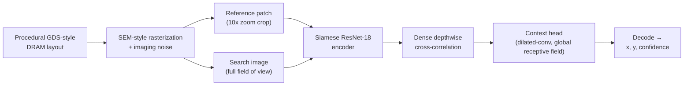
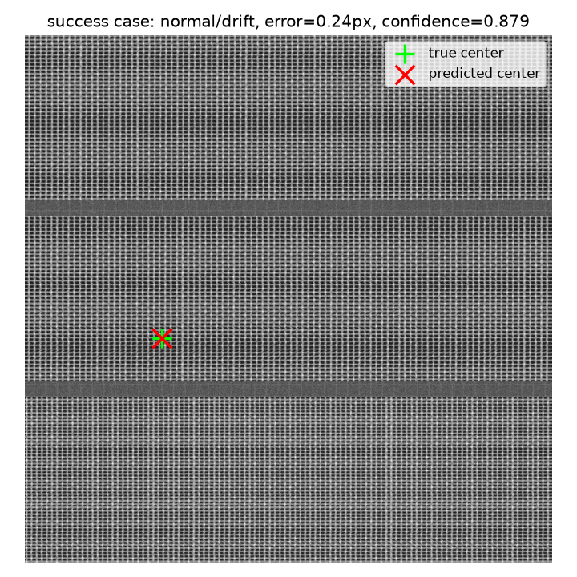
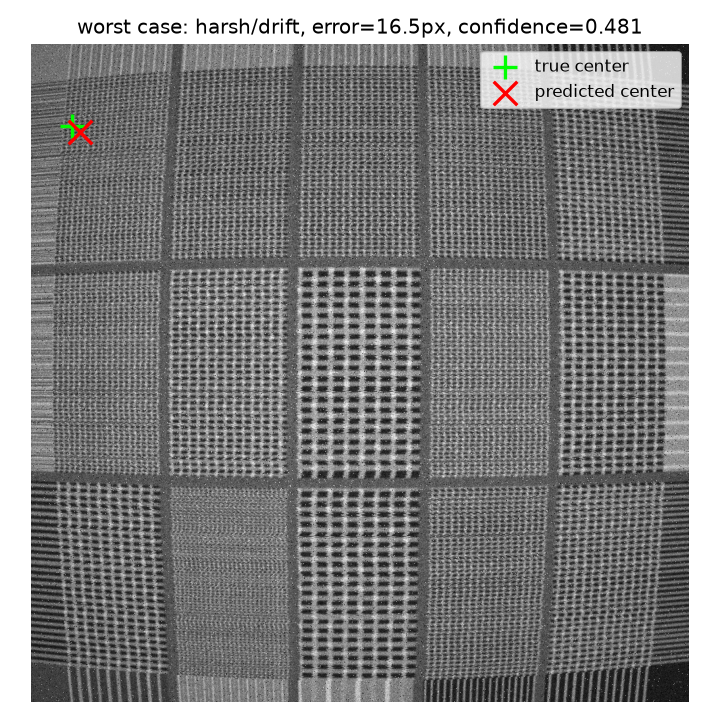

# Drift-Sense — Reference Localizer

**SEMI x IESA Hackathon 2026 — Applied Materials Problem Statement:
Drift-Sense — AI-Powered Navigation-Error Recovery for Wafer Inspection Tools.**

A deep-learning solution for finding where a small, high-magnification
**reference** SEM image sits inside a wider, lower-magnification **search**
image at a nominal 10:1 zoom difference — the navigation-recovery task an
inspection tool needs to solve after stage drift, vibration or thermal
effects knock it off its intended coordinate.

**Core idea:** dense correlation between Siamese-encoded features, followed
by a global-receptive-field context head to resolve the periodic-DRAM-lattice
ambiguity that a purely local encoder can't — a reference patch can look
identical to several lattice repeats, and only wide spatial context (mat/die
boundaries, aperiodic imaging noise) disambiguates which repeat is the true
one.

`solution_presentation.pptx` is the mandatory hackathon submission slide
deck (see the note at the bottom of this file — **not yet added to this
folder**).

---

## 1. How it works



A synthetic DRAM memory array — word lines, bit lines, contacts, none of it
proprietary geometry — is laid out, rendered as a grayscale SEM-style image,
and degraded with an imaging-noise model (Poisson shot noise, beam
astigmatism, raster drift, charging streaks, vignetting, and more). A
**reference** patch and the wider **search** frame it came from are cut from
that render, at a 10x zoom difference between them, with the reference's
true location kept as ground truth.

The localizer never sees that ground truth directly. It Siamese-encodes both
images, densely cross-correlates their features, then runs the correlation
surface through a wide-receptive-field context head — the step that resolves
DRAM's repeating-lattice ambiguity, where a reference patch can look
identical to several other spots on the same die and only broader spatial
context (die boundaries, aperiodic noise) disambiguates which one is real.
Decoding the resulting heatmap gives a predicted `(x, y)` and a confidence
score.

## 2. Results at a glance

Validated against `model/production_v3/best.pt` across four
noise x geometry conditions (200 samples pooled, see
[`results/validation_report.md`](results/validation_report.md) for the
full breakdown and reproduction steps):

| Condition | Mean error (px) | Pass @ 5px | Pass @ 1px | Median runtime (ms) |
|---|---|---|---|---|
| Normal noise, normal geometry | 0.64 | 100.0% | 86.0% | 21.9 |
| Harsh noise, normal geometry | 4.32 | 64.0% | 22.0% | 21.9 |
| Normal noise, drift geometry | 0.67 | 100.0% | 86.0% | 22.0 |
| Harsh noise, drift geometry | 4.28 | 64.0% | 22.0% | 22.0 |
| **Pooled (n=200)** | **2.47** | — | — | — |

<div align="center">
<table>
<tr>
<td align="center" width="50%">
<br/>
<sub><b>Typical case</b> — sub-pixel error, high confidence</sub>
</td>
<td align="center" width="50%">
<br/>
<sub><b>Worst case</b> — 16.5px error under harsh noise + drift, a genuine repeated-pattern look-alike</sub>
</td>
</tr>
</table>
</div>

## 3. Folder structure

```
submission/
├── solution_presentation.pptx   mandatory slide deck (not yet added — see note at bottom)
├── README.md                    this file
├── requirements.txt             pinned dependencies
├── generate_dataset.py          persisted reference/search PNG pairs + manifest.csv
├── localize.py                  single-pair or evaluator-batch inference
├── configs/                     LocalizerConfig defaults, documented (see configs/README.md)
├── src/                         generator infra (src/) + the model (src/localizer/)
│   ├── pipeline.py, sem_imaging.py, presets.py, structural_defects.py
│   ├── patterns/                 DRAM / FinFET / zone-routing pattern generators
│   └── localizer/                 the model: encoder, correlation, context head, decode, ...
├── scripts/                     train, predict, validate, calibrate, ablate
├── model/                       shipped checkpoint(s)
│   └── production_v3/             best.pt — the default model (see §5 below)
├── tests/                       pytest suite
├── results/                     validation report, plots, sample dataset
└── references/                  citations backing structures, noise modeling and the algorithm
```

Everything needed to run the submission — dataset generation, localization,
tests, results, citations — lives in this one self-contained folder.

## 4. Setup

```bash
cd submission
python -m venv .venv && source .venv/bin/activate
pip install -r requirements.txt
```

`requirements.txt` pins `torch==2.13.0+cu130` / `torchvision==0.28.0+cu130`.
Those are **local version labels** — `pip` can only resolve them from
PyTorch's own wheel index, not plain PyPI:

```bash
pip install torch==2.13.0+cu130 torchvision==0.28.0+cu130 \
    --extra-index-url https://download.pytorch.org/whl/cu130
```

If you're on a different CUDA version (or CPU-only), install whatever
`torch`/`torchvision` build matches your machine instead — nothing in this
code is tied to that specific build, it's just what was validated during
development. CPU-only works fine for inference (`localize.py` /
`scripts/predict.py`) on a single image pair; training is impractically
slow without a GPU.

Verify the install:

```bash
python -m pytest tests/ -q -m "not slow"
```

The `slow`-marked tests run real subprocess training/inference runs, live
optimizer steps, and a receptive-field measurement — include them with
`-m slow` or drop `-m "not slow"` entirely for the full suite (a few minutes
instead of under a minute).
`tests/localizer/test_model.py::test_predictions_lie_inside_the_valid_range`
is a known pre-existing flaky test (unseeded random weight init, unrelated
to any change here) — if it fails, re-run just that test in isolation to
confirm it's this, not a real regression.

All commands below assume you're running from this folder's root
(`submission/`), with the venv active.

---

## 5. Quick start: predict on your own images

```bash
python localize.py --checkpoint model/production_v3/best.pt \
    --reference path/to/reference.png --search path/to/search.png --verbose
```

Output:
```
predicted_x=484.77 predicted_y=898.32 confidence=0.0745
```

(`--verbose` prints labeled fields; omit it for machine-readable
`x,y,confidence` on one line. `--checkpoint` defaults to
`model/production_v3/best.pt`, resolved relative to `localize.py` itself, so
it works from any working directory — this also means the flag can be
omitted entirely, as shown above.)

For an external grader expecting exactly one `(x, y)` coordinate and nothing
else on stdout:

```bash
python localize.py --reference ref.png --search search.png --xy-only
```

**Input requirements**, enforced by the script (it raises a clear error if
violated rather than failing deep inside the model):
- **Search image** must be exactly `1000x1000` px, grayscale.
- **Reference image** is auto-resized to `100x100` px — this assumes it's
  already at the correct physical scale (the reference is imaged at 10x the
  search image's resolution over the same real-world area).

Confidence is a **peak margin**, not a raw score — treat it as a ranking
signal across multiple predictions, not a calibrated probability. It can be
slightly negative when the decode logic's centre-tiebreak overrides raw peak
ranking; that's expected, not an error.

**Coordinate convention:** origin `(0, 0)` is the search image's top-left
corner; `x` increases rightward, `y` increases downward. Predicted
coordinates are always given in **search-image pixels**, regardless of the
reference's native resolution.

**Multiple matches:** if the reference pattern genuinely repeats within the
search image (a real possibility for periodic DRAM lattices), the decoder's
NMS + centre-tiebreak logic (`src/localizer/decode.py`) selects the
candidate closest to the search image's centre, matching the spec's
tie-break rule.

## 6. Generating a persisted dataset

```bash
python generate_dataset.py --split test --num-samples 30 --output-dir ./output
```

Writes `output/reference/*.png` (1000x1000, upscaled from the model's native
100x100 representation), `output/search/*.png` (1000x1000), and
`output/manifest.csv` (ground truth and generation metadata per pair —
random seed, transformations, noise settings, scale, rotation), drawing from
the same on-the-fly generator (`src/localizer/data.py`) that training itself
uses — so a dataset written here is representative of what the model was
actually trained/evaluated on. `--split` picks a canvas-disjoint seed range
(`train`/`val`/`test`, matching `LocalizerConfig`); `--imaging-noise-profile`
(`normal`/`harsh`) and `--geometric-profile` (`normal`/`drift`) control
noise severity and scale/rotation jitter.

## 7. Batch localization

```bash
python localize.py --checkpoint model/production_v3/best.pt \
    --manifest output/manifest.csv --output predictions.csv
```

Reads `reference_path`/`search_path` columns from any manifest (including
one an evaluator supplies, or `generate_dataset.py`'s own output) and writes
`predictions.csv` with every input column carried through (ground truth,
generation metadata) plus `predicted_x, predicted_y, confidence, runtime_ms`
appended — one self-contained row per input pair, no source-code edits
needed between a single pair and a full batch.

## 8. Validation report

```bash
python scripts/validation_report.py \
    --checkpoint model/production_v3/best.pt \
    --n-per-condition 50 --out-dir results
```

Runs the model across all four `{imaging_noise_profile} x
{geometric_profile}` combinations and writes `results/validation_report.md`
(human-readable per-condition table: mean/median/worst Euclidean error, pass
rate @5/4/2/1px, median runtime), `results/validation_report.json` (the same
data, machine-readable), and `results/failure_case.png` (the worst
prediction across all conditions, with true/predicted centres marked and a
root-cause note in the report). Already run against `production_v3` and
committed — pooled mean error 2.47px over 200 samples.

`results/sample_dataset/` is a committed, concrete example of the full
generate → predict pipeline: 32 pairs (8 each across all four noise x
geometry conditions), generated via `generate_dataset.py` and run through
`localize.py --manifest`. `results/sample_dataset/predictions.csv` combines
every generation column with the model's predictions for the same 32 rows
(mean error 2.00px, pass@5px 0.906 on this specific sample).

## 9. Training your own model

```bash
python scripts/train.py --run-name my_run --max-steps 40000
```

See `python scripts/train.py --help` for the full flag list, including
`--imaging-noise-profile` / `--geometric-profile` (the two robustness axes
`production_v3` was trained under) and `--init-from` (warm-start from
another checkpoint). Checkpoints land in `checkpoints/<run-name>/best.pt`
(a fresh local output directory — distinct from the shipped `model/`
directory this repo ships pretrained weights in).

Three automatic safety nets guard against training collapse (non-finite
input skip, non-finite loss skip, auto-rollback on collapsed validation) —
see `scripts/train.py`'s module docstring for details.

`decode()`'s tie-break threshold (`peak_tie_ratio`, shipped default `0.98`)
is calibrated on validation data via `scripts/calibrate_tie_ratio.py`, not
picked arbitrarily; `scripts/ablation_jitter.py` and
`scripts/ablation_negative.py` are diagnostic scripts probing whether the
model relies on synthetic-noise fingerprints and whether its confidence
score is a genuine "reference not present" signal, respectively.

## 10. About the provided checkpoint

`model/production_v3/best.pt` is the result of a training lineage: an
original 40000-step run, fine-tuned under `--imaging-noise-profile harsh`
alone, then continued again adding `--geometric-profile drift` on top — so
the final weights are trained under both robustness axes together.
`hard_negative_radius_cells=24` is a real, validated result from a 4-way
radius sweep (6/12/24/48), not a guess. Consistently strong across every
condition in `scripts/validation_report.py`'s noise x geometry matrix
(pooled mean error 2.47px). See §8 for the full per-condition breakdown.

## 11. Config

[`configs/default.yaml`](configs/default.yaml) documents every value in
[`LocalizerConfig`](src/localizer/config.py) (the dataclass that actually
drives training, decoding and evaluation) for anyone auditing or
reproducing a run without reading Python.

## 12. Citations

Public sources backing the synthetic-data/noise-modeling design and the
localization algorithm are collected, with a per-component code mapping, in
[`references/README.md`](references/README.md).

---

**Note on `solution_presentation.pptx`.** The hackathon spec requires a
12-slide solution deck (problem understanding, workflow, dataset design,
noise/augmentation citations, localization method, execution commands,
experiments, threshold-wise results, runtime, robustness/ablations, an
honest failure case, and conclusion). It is **not present in this
repository yet** — this README, `results/`, and `references/` contain the
material a deck would draw from, but the `.pptx` file itself still needs to
be authored and added at `submission/solution_presentation.pptx` before this
folder is submission-ready.
