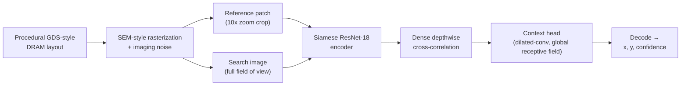

# Drift-Sense — Reference Localizer


**SEMI x IESA Hackathon 2026 — Applied Materials Problem Statement:
Drift-Sense — AI-Powered Navigation-Error Recovery for Wafer Inspection Tools**

> **In short:** given a small, sharp close-up photo of one spot on a
> silicon wafer (the *reference*) and a wider, blurrier photo covering a
> larger area (the *search image*), this project finds exactly where in
> the wider photo the close-up was taken — even when the wafer's pattern
> repeats itself many times and looks nearly identical everywhere. It ships
> a synthetic-data generator, a trained deep-learning model, and the
> evaluation tooling to reproduce every number reported below.

`solution_presentation.pptx` is the mandatory hackathon submission slide
deck — see the note at the bottom of this file (**not yet added to this
folder**).

---

## Contents

1. [The problem, in plain terms](#1-the-problem-in-plain-terms)
2. [How the solution works](#2-how-the-solution-works)
3. [Results at a glance](#3-results-at-a-glance)
4. [Repository layout](#4-repository-layout)
5. [Setup](#5-setup)
6. [Command reference](#6-command-reference)
7. [Predicting on your own images](#7-predicting-on-your-own-images)
8. [Generating a dataset](#8-generating-a-dataset)
9. [Batch localization](#9-batch-localization)
10. [Validation report](#10-validation-report)
11. [Training your own model](#11-training-your-own-model)
12. [About the shipped checkpoint](#12-about-the-shipped-checkpoint)
13. [Configuration](#13-configuration)
14. [Citations](#14-citations)

---

## 1. The problem, in plain terms

Wafer inspection tools revisit the same spot over and over — but stage
drift, vibration, or thermal expansion can nudge the tool off-target
between visits. Think of it like being handed a close-up photo of a single
tile from a huge, repetitive-patterned floor, then being dropped somewhere
on that floor and asked: *"find the exact tile this photo was taken of."*

Two complications make that hard here:

- **The floor tiles are nearly identical.** A silicon wafer's memory-cell
  layout repeats every few pixels, so a naive "does this patch look the
  same" search finds *many* equally good matches — most of them wrong.
- **The two photos aren't the same zoom.** The close-up (*reference*) is a
  100x-magnification shot; the wider photo (*search image*) is a 10x shot
  of the same physical region. Both arrive as the same pixel dimensions
  (1000x1000), but a reference pixel and a search-image pixel represent
  very different physical distances — so before any matching happens, the
  10:1 scale gap has to be accounted for explicitly, not stumbled into by
  accident.

This project's job: given a reference/search pair, return the pixel
coordinates `(x, y)` in the search image where the reference patch actually
is — accurately, automatically, and even as noise, blur, and scale/rotation
jitter increase.

## 2. How the solution works



**Data (left half of the diagram).** A synthetic DRAM memory array — word
lines, bit lines, contacts, none of it proprietary geometry — is laid out
and rendered as a grayscale SEM-style image, then degraded with a
realistic imaging-noise model (Poisson shot noise, beam astigmatism, raster
drift, charging streaks, vignetting, and more). A **reference** patch and
the wider **search** frame it came from are cut from that render, at a 10x
zoom difference between them, with the reference's true location kept as
ground truth for training and evaluation.

**Model (right half of the diagram).** In plain terms: the model looks at
the reference and the search image with the *same pair of eyes* (a shared,
"Siamese" encoder — the same network runs on both images so their features
are directly comparable), overlays the reference's features onto every
position in the search image to score how well each one matches (the
*cross-correlation* step), and then looks at that whole score map at once
— not just each score in isolation — to figure out which of the many
similar-looking candidates is the *real* one. That last step is what a
simple "find the highest score" approach can't do: on a repetitive DRAM
lattice, several positions score almost identically, and only broader
spatial context (where the die boundaries are, where the noise pattern is
asymmetric) can break the tie correctly. The output is a heatmap over the
search image; its peak, refined to sub-pixel precision, is the predicted
`(x, y)`, alongside a confidence score.

<details>
<summary><b>More technical detail</b> (architecture internals)</summary>

- **Encoder:** a destrided ResNet-18 (no ImageNet pretraining) shared
  between both images — "destrided" so its output keeps enough spatial
  resolution for a dense, pixel-precise correlation instead of collapsing
  to a single feature vector.
- **Correlation:** dense *depthwise* cross-correlation (channel-by-channel,
  not collapsed to a scalar) between the reference's and search image's
  feature maps, producing a per-channel similarity volume rather than one
  flat score map.
- **Context head:** a 9-layer dilated-convolution stack with a receptive
  field spanning the entire correlation map, so the final decision can see
  the whole search image at once — this is the specific mechanism that
  resolves repeated-pattern ambiguity.
- **Decode:** the resulting heatmap plus a learned sub-cell offset field
  are combined into a sub-pixel `(x, y)`, with non-max suppression and a
  calibrated centre-tiebreak rule for when multiple peaks are genuinely
  tied (see [§7](#7-predicting-on-your-own-images) — "Multiple matches").

Full component-by-component code map and the papers behind each choice are
in [`references/README.md`](references/README.md).
</details>

## 3. Results at a glance

Validated against `model/production_v3/best.pt` across four
noise x geometry conditions (200 samples pooled — see
[`results/validation_report.md`](results/validation_report.md) for the
full breakdown and reproduction steps):

| Condition | Mean error (px) | Pass @ 5px | Pass @ 1px | Median runtime (ms) |
|---|---|---|---|---|
| Normal noise, normal geometry | 0.64 | 100.0% | 86.0% | 21.9 |
| Harsh noise, normal geometry | 4.32 | 64.0% | 22.0% | 21.9 |
| Normal noise, drift geometry | 0.67 | 100.0% | 86.0% | 22.0 |
| Harsh noise, drift geometry | 4.28 | 64.0% | 22.0% | 22.0 |
| **Pooled (n=200)** | **2.47** | — | — | — |

*"Normal" vs. "harsh" noise controls acquisition-noise severity (dose,
astigmatism, charging, speckle, etc.); "normal" vs. "drift" geometry
controls whether the reference crop also carries scale jitter (9:1–11:1)
and rotation (±2°) on top of the nominal 10:1 relationship — see
[§8](#8-generating-a-dataset).*

<div align="center">
<table>
<tr>
<td align="center" width="50%">
<br/>
<sub><b>Typical case</b> — sub-pixel error, high confidence</sub>
</td>
<td align="center" width="50%">
<br/>
<sub><b>Worst case</b> — 16.5px error under harsh noise + drift, a genuine repeated-pattern look-alike</sub>
</td>
</tr>
</table>
</div>

## 4. Repository layout

```
submission/
├── solution_presentation.pptx   mandatory slide deck (not yet added — see note at bottom)
├── README.md                    this file
├── requirements.txt             pinned dependencies
├── generate_dataset.py          persisted reference/search PNG pairs + manifest.csv
├── localize.py                  single-pair or evaluator-batch inference
├── configs/                     LocalizerConfig defaults, documented (see configs/README.md)
├── src/                         generator infra (src/) + the model (src/localizer/)
│   ├── pipeline.py, sem_imaging.py, presets.py, structural_defects.py
│   ├── patterns/                 DRAM / FinFET / zone-routing pattern generators
│   └── localizer/                 the model: encoder, correlation, context head, decode, ...
├── scripts/                     train, predict, validate, calibrate, ablate
├── model/                       shipped checkpoint(s)
│   └── production_v3/             best.pt — the default model (see §12)
├── tests/                       pytest suite
├── results/                     validation report, plots, sample dataset
└── references/                  citations backing structures, noise modeling and the algorithm
```

Everything needed to run the submission — dataset generation, localization,
tests, results, citations — lives in this one self-contained folder; no
path reaches outside it.

## 5. Setup

```bash
cd submission
python -m venv .venv && source .venv/bin/activate
pip install -r requirements.txt
```

`requirements.txt` pins `torch==2.13.0+cu130` / `torchvision==0.28.0+cu130`.
Those are **local version labels** — `pip` can only resolve them from
PyTorch's own wheel index, not plain PyPI:

```bash
pip install torch==2.13.0+cu130 torchvision==0.28.0+cu130 \
    --extra-index-url https://download.pytorch.org/whl/cu130
```

If you're on a different CUDA version (or CPU-only), install whatever
`torch`/`torchvision` build matches your machine instead — nothing in this
code is tied to that specific build, it's just what was validated during
development. CPU-only works fine for inference (`localize.py` /
`scripts/predict.py`) on a single image pair; training is impractically
slow without a GPU.

Verify the install:

```bash
python -m pytest tests/ -q -m "not slow"
```

The `slow`-marked tests run real subprocess training/inference runs, live
optimizer steps, and a receptive-field measurement — include them with
`-m slow`, or drop `-m "not slow"` entirely for the full suite (a few
minutes instead of under one).
`tests/localizer/test_model.py::test_predictions_lie_inside_the_valid_range`
is a known pre-existing flaky test (unseeded random weight init, unrelated
to any change here) — if it fails, re-run just that test in isolation to
confirm it's this, not a real regression.

All commands from here on assume you're running from this folder's root
(`submission/`), with the venv active.

## 6. Command reference

A one-glance summary of every entry point — details and full flag lists
follow in the sections linked from the right-hand column.

| Task | Command | Details |
|---|---|---|
| Predict on one pair | `python localize.py --reference r.png --search s.png` | [§7](#7-predicting-on-your-own-images) |
| Generate a dataset | `python generate_dataset.py --split test --num-samples 30 --output-dir ./output` | [§8](#8-generating-a-dataset) |
| Batch-predict a manifest | `python localize.py --manifest output/manifest.csv --output predictions.csv` | [§9](#9-batch-localization) |
| Run the validation report | `python scripts/validation_report.py --n-per-condition 50 --out-dir results` | [§10](#10-validation-report) |
| Train a model | `python scripts/train.py --run-name my_run --max-steps 40000` | [§11](#11-training-your-own-model) |
| Run tests | `python -m pytest tests/ -q -m "not slow"` | [§5](#5-setup) |

## 7. Predicting on your own images

```bash
python localize.py --checkpoint model/production_v3/best.pt \
    --reference path/to/reference.png --search path/to/search.png --verbose
```

Output:
```
predicted_x=484.77 predicted_y=898.32 confidence=0.0745
```

(`--verbose` prints labeled fields; omit it for machine-readable
`x,y,confidence` on one line. `--checkpoint` defaults to
`model/production_v3/best.pt`, resolved relative to `localize.py` itself, so
it works from any working directory — this also means the flag can be
omitted entirely, as shown above.)

For an external grader expecting exactly one `(x, y)` coordinate and
nothing else on stdout:

```bash
python localize.py --reference ref.png --search search.png --xy-only
```

**Input requirements**, enforced by the script (it raises a clear error if
violated rather than failing deep inside the model):
- **Search image** must be exactly `1000x1000` px, grayscale.
- **Reference image** is auto-resized to `100x100` px — this assumes it's
  already at the correct physical scale (the reference is imaged at 10x the
  search image's resolution over the same real-world area).

**Confidence** is a *peak margin*, not a raw score — treat it as a ranking
signal across multiple predictions, not a calibrated probability. It can be
slightly negative when the decode logic's centre-tiebreak overrides raw
peak ranking; that's expected, not an error.

**Coordinate convention:** origin `(0, 0)` is the search image's top-left
corner; `x` increases rightward, `y` increases downward. Predicted
coordinates are always given in **search-image pixels**, regardless of the
reference's native resolution.

**Multiple matches:** if the reference pattern genuinely repeats within the
search image (a real possibility for periodic DRAM lattices), the decoder's
NMS + centre-tiebreak logic (`src/localizer/decode.py`) selects the
candidate closest to the search image's centre, matching the spec's
tie-break rule.

## 8. Generating a dataset

```bash
python generate_dataset.py --split test --num-samples 30 --output-dir ./output
```

Writes `output/reference/*.png` (1000x1000, upscaled from the model's
native 100x100 representation), `output/search/*.png` (1000x1000), and
`output/manifest.csv` (ground truth and generation metadata per pair —
random seed, transformations, noise settings, scale, rotation), drawing
from the same on-the-fly generator (`src/localizer/data.py`) that training
itself uses — so a dataset written here is representative of what the
model was actually trained/evaluated on.

| Flag | Values | Effect |
|---|---|---|
| `--split` | `train` / `val` / `test` | picks a canvas-disjoint seed range, matching `LocalizerConfig` |
| `--imaging-noise-profile` | `normal` / `harsh` | acquisition-noise severity |
| `--geometric-profile` | `normal` / `drift` | adds ~9:1–11:1 scale jitter and ±2° rotation to the reference crop |

## 9. Batch localization

```bash
python localize.py --checkpoint model/production_v3/best.pt \
    --manifest output/manifest.csv --output predictions.csv
```

Reads `reference_path`/`search_path` columns from any manifest (including
one an evaluator supplies, or `generate_dataset.py`'s own output) and
writes `predictions.csv` with every input column carried through (ground
truth, generation metadata) plus `predicted_x, predicted_y, confidence,
runtime_ms` appended — one self-contained row per input pair, no
source-code edits needed between a single pair and a full batch.

## 10. Validation report

```bash
python scripts/validation_report.py \
    --checkpoint model/production_v3/best.pt \
    --n-per-condition 50 --out-dir results
```

Runs the model across all four `{imaging_noise_profile} x
{geometric_profile}` combinations and writes `results/validation_report.md`
(human-readable per-condition table: mean/median/worst Euclidean error,
pass rate @5/4/2/1px, median runtime), `results/validation_report.json`
(the same data, machine-readable), and `results/failure_case.png` (the
worst prediction across all conditions, with true/predicted centres marked
and a root-cause note in the report). Already run against `production_v3`
and committed — pooled mean error 2.47px over 200 samples (see
[§3](#3-results-at-a-glance)).

`results/sample_dataset/` is a committed, concrete example of the full
generate → predict pipeline: 32 pairs (8 each across all four noise x
geometry conditions), generated via `generate_dataset.py` and run through
`localize.py --manifest`. `results/sample_dataset/predictions.csv` combines
every generation column with the model's predictions for the same 32 rows
(mean error 2.00px, pass@5px 0.906 on this specific sample).

## 11. Training your own model

```bash
python scripts/train.py --run-name my_run --max-steps 40000
```

See `python scripts/train.py --help` for the full flag list, including
`--imaging-noise-profile` / `--geometric-profile` (the two robustness axes
`production_v3` was trained under) and `--init-from` (warm-start from
another checkpoint). Checkpoints land in `checkpoints/<run-name>/best.pt` —
a fresh local output directory, distinct from the shipped `model/`
directory this repo ships pretrained weights in.

<details>
<summary>Training safety nets and calibration/diagnostic scripts</summary>

**Three automatic safety nets guard against training collapse**, no flag
needed:
1. **Non-finite input skip** — a batch with a non-finite pixel value (a
   rare edge case under `--imaging-noise-profile harsh`) is skipped before
   it reaches the model.
2. **Non-finite loss skip** — if the loss itself comes out non-finite, the
   optimizer step is skipped.
3. **Auto-rollback on collapsed validation** — if validation ever returns
   `nan` predictions (the signature of BatchNorm corruption), training
   automatically reloads the last known-good checkpoint and continues.

**Calibration and diagnostics:**
- `scripts/calibrate_tie_ratio.py` — `decode()`'s tie-break threshold
  (`peak_tie_ratio`, shipped default `0.98`) is calibrated on validation
  data, not picked arbitrarily.
- `scripts/ablation_jitter.py` — tests whether the model relies on
  synthetic-noise fingerprints rather than genuine pattern aperiodicity.
- `scripts/ablation_negative.py` — tests whether `confidence` is a genuine
  "the reference isn't actually present" signal.
</details>

## 12. About the shipped checkpoint

`model/production_v3/best.pt` is the only checkpoint shipped with this
submission, and the default for every command above. It's the result of a
training lineage: an original 40000-step run, fine-tuned under
`--imaging-noise-profile harsh` alone, then continued again adding
`--geometric-profile drift` on top — so the final weights are trained under
both robustness axes together. `hard_negative_radius_cells=24` is a real,
validated result from a 4-way radius sweep (6/12/24/48), not a guess.
Consistently strong across every condition in
`scripts/validation_report.py`'s noise x geometry matrix (pooled mean error
2.47px — full per-condition breakdown in [§3](#3-results-at-a-glance)).

## 13. Configuration

[`configs/default.yaml`](configs/default.yaml) documents every value in
[`LocalizerConfig`](src/localizer/config.py) (the dataclass that actually
drives training, decoding and evaluation) for anyone auditing or
reproducing a run without reading Python.

## 14. Citations

Public sources backing the synthetic-data/noise-modeling design and the
localization algorithm are collected, with a per-component code mapping, in
[`references/README.md`](references/README.md).

---

**Note on `solution_presentation.pptx`.** The hackathon spec requires a
12-slide solution deck (problem understanding, workflow, dataset design,
noise/augmentation citations, localization method, execution commands,
experiments, threshold-wise results, runtime, robustness/ablations, an
honest failure case, and conclusion). It is **not present in this
repository yet** — this README, `results/`, and `references/` contain the
material a deck would draw from, but the `.pptx` file itself still needs to
be authored and added at `submission/solution_presentation.pptx` before
this folder is submission-ready.
